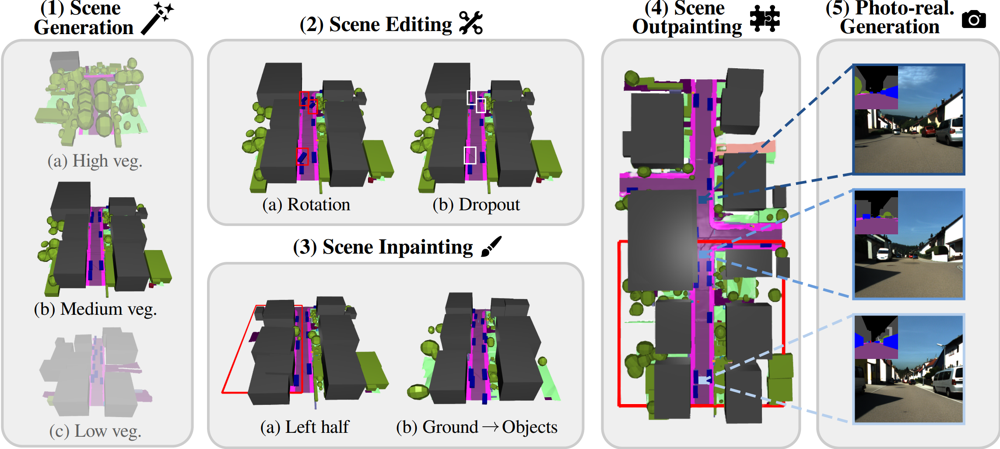

<p align="center">

  <h1 align="center">PrITTI: Primitive-based Generation of <br> Controllable and Editable 3D Semantic Scenes</h1>
  <p align="center">
    <a href="https://raniatze.github.io/">Christina Ourania Tze</a>
    ·
    <a href="https://danieldauner.github.io/">Daniel Dauner</a>
    ·
    <a href="https://yiyiliao.github.io/">Yiyi Liao</a>
    ·
    <a href="https://fr.linkedin.com/in/dzmitry-tsishkou-9b287724/">Dzmitry Tsishkou</a>
    ·
    <a href="http://www.cvlibs.net/">Andreas Geiger</a>

  </p>

  <h3 align="center"><a href="http://arxiv.org/abs/2506.19117">Paper</a> | <a href="https://raniatze.github.io/pritti/">Project Page</a>  </h3>
  <div align="center"></div>
</p>


<p align="center">
  
</p>

<p align="center">
We introduce PrITTI, a latent diffusion-based framework that leverages primitives as the main foundational elements for generating compositional, controllable, and editable 3D semantic scene layouts. Our approach enables applications such as scene editing, inpainting, outpainting, and photo-realistic street view synthesis.  
</p>
<br>


<br>

# 🚀 Code

Code and pre-trained models coming soon!

# Citation
If you find our code or paper useful, please cite
```bibtex
@article{Tze2025PrITTI,
    author    = {Tze, Christina Ourania and Dauner, Daniel and Liao, Yiyi and Tsishkou, Dzmitry and Geiger, Andreas},
    title     = {PrITTI: Primitive-based Generation of Controllable and Editable 3D Semantic Scenes},
    journal   = {arXiv preprint arXiv:2506.19117},
    year      = {2025},
}
```
